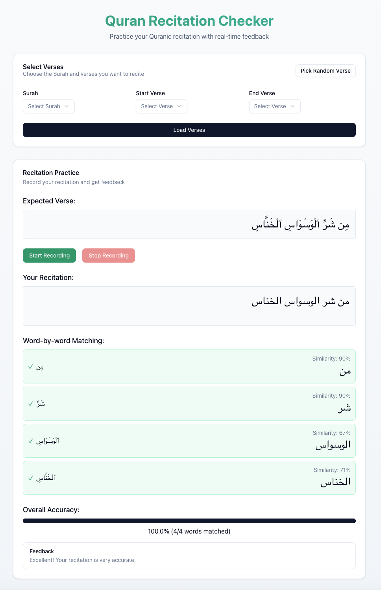

# Quran Recitation Checker

A Next.js application that helps users practice Quran recitation by providing a platform to record and check their recitations against the original Arabic text.



## Getting Started

Run the development server:

```bash
npm run dev
```

Open [http://localhost:3000](http://localhost:3000) with your browser to see the result.

## Technical Overview

### Architecture

This application is built with the following technologies:

- **Frontend**: Next.js
- **UI Components**: Shadcn UI (based on Radix UI)
- **Speech Recognition**: Web Speech API (browser-based)

### Core Components

#### 1. Main Components

- `components/recitation-checker.tsx`: The primary component that handles:
  - Verse selection and display
  - Audio recording functionality
  - Transcription processing
  - Recitation checking

#### 2. API Routes

- `app/api/quran/route.ts`: Proxies requests to the Quran API ([api.alquran.cloud](https://alquran.cloud/api)) to avoid CORS issues and handles text normalization for proper Arabic display

### Key Features

#### 1. Quran Text Fetching

The application fetches Quranic verses from the Quran API with the following capabilities:
- Fetch specific surah (chapter)
- Fetch specific verse ranges using offset and limit parameters
- Display Arabic text

#### 2. Arabic Text Processing

Special care is taken to properly display Arabic text:
- Uses specialized Arabic fonts (Amiri, Scheherazade New, Noto Naskh Arabic)
- Implements text normalization to handle special Unicode characters
- Preserves essential diacritical marks for proper Quranic recitation

#### 3. Transcription

The transcription is handled by the browser's Web Speech API, which:
- Converts audio to text in real-time
- Provides feedback while speaking
- Handles partial and final transcriptions

#### 4. Word Matching

The application splits the expected verse into individual words using Arabic-specific text recognition (matching Unicode character ranges \u0600-\u06FF), then compares each word against the transcribed text.
Apply Levenshtein distance algorithm with Arabic character normalization, to evaluates similarity at the word level rather than the entire verse.

#### 5. Progress Tracking

The application tracks the progress of the recitation by:
- Displaying the current verse and percentage completed
- Providing a progress bar to show the user's progress

## Deploy on Vercel

The easiest way to deploy your Next.js app is to use the [Vercel Platform](https://vercel.com/new?utm_medium=default-template&filter=next.js&utm_source=create-next-app&utm_campaign=create-next-app-readme) from the creators of Next.js.

Check out our [Next.js deployment documentation](https://nextjs.org/docs/app/building-your-application/deploying) for more details.
